<div align="center">

# Yappy

### Small details. Better conversations.

A full-stack real-time chat app with direct and group conversations, image sharing, and a personalized workspace across desktop and mobile.


[Explore the UI](#screenshots) · [Watch the demo](showcase/portfolio/yappy-demo-web.mp4) · [Architecture](#system-architecture) · [Run locally](#getting-started)

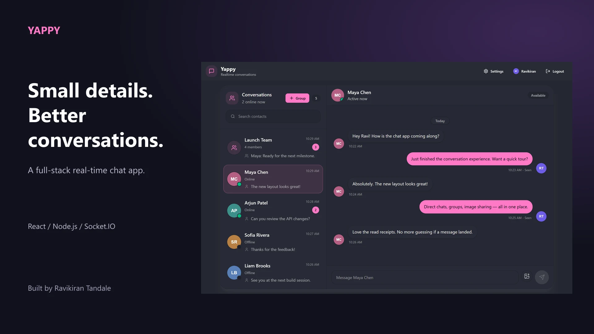

</div>

## Overview

Yappy brings contacts, group conversations, and message activity into one focused interface. A searchable inbox surfaces unread counts and recent messages, while the conversation view provides typing feedback, image attachments, and direct-message delivery and seen states. On mobile, the layout switches between the inbox and a focused chat view.

Built by [Ravikiran Tandale](https://github.com/Ravi-rk7).

## Features

| Area | What Yappy supports |
| --- | --- |
| Direct messaging | Real-time text conversations, persistent history, and optimistic sending with rollback on failure. |
| Group conversations | Create named groups, select members, exchange text and images, and track unread messages. |
| Conversation awareness | Online presence, last-seen information, typing indicators, unread badges, and last-message previews. |
| Message lifecycle | Delivery and seen states for direct messages, group read tracking, and deletion of your own messages. |
| Image sharing | Attachment previews and Cloudinary-backed uploads in direct and group chats. |
| Accounts | Registration, login, logout, protected API routes, and profile avatar updates. |
| Personalization | 32 DaisyUI themes with a live preview and a locally saved preference. |
| Responsive interface | Desktop split view, mobile inbox/chat navigation, loading skeletons, and toast feedback. |

## Screenshots

### A focused conversation workspace

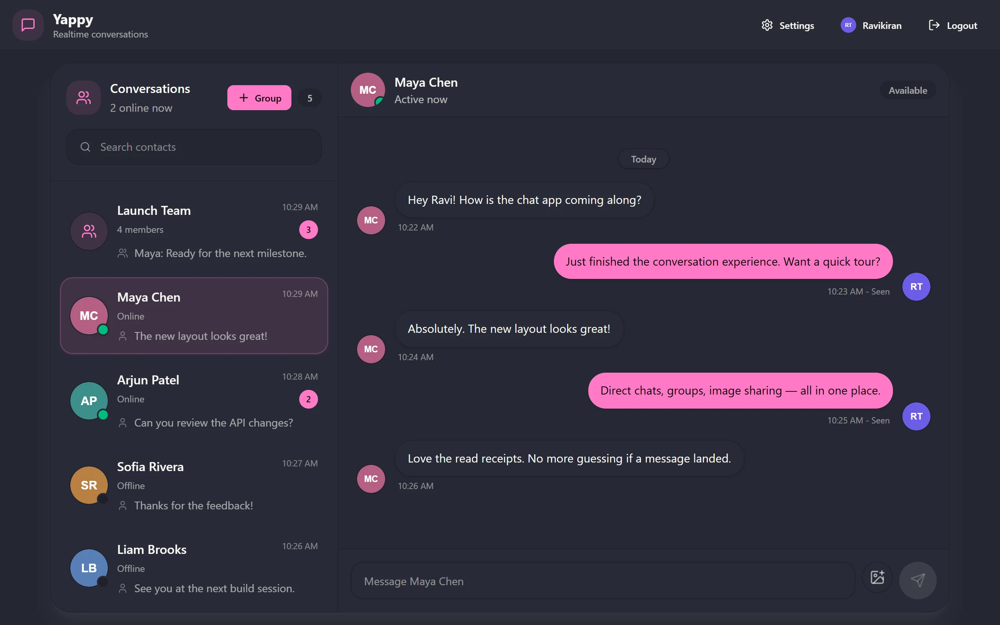

<table>
  <tr>
    <td width="50%">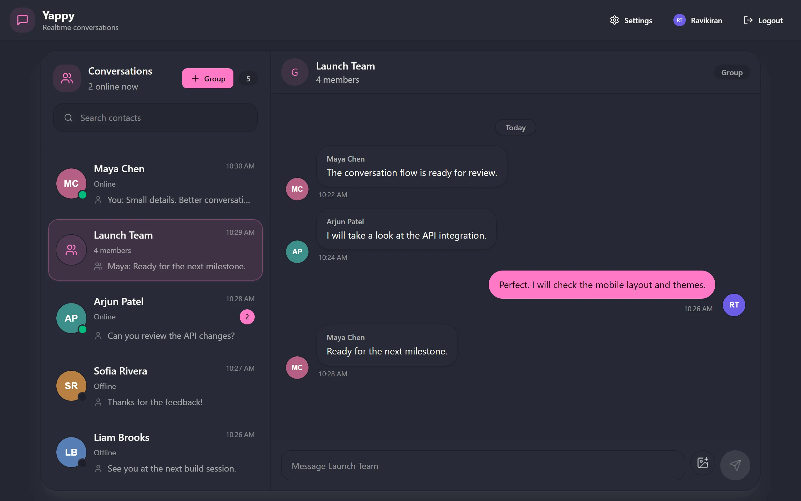<br /><strong>Group conversations</strong><br />Keep shared discussions together.</td>
    <td width="50%">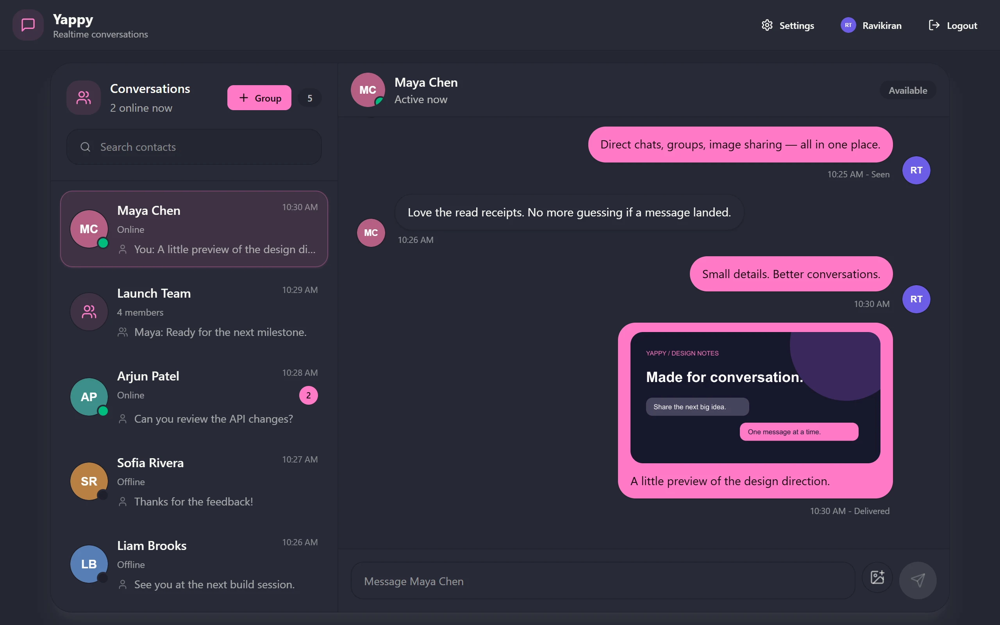<br /><strong>Image sharing</strong><br />Bring visual context into the chat.</td>
  </tr>
  <tr>
    <td>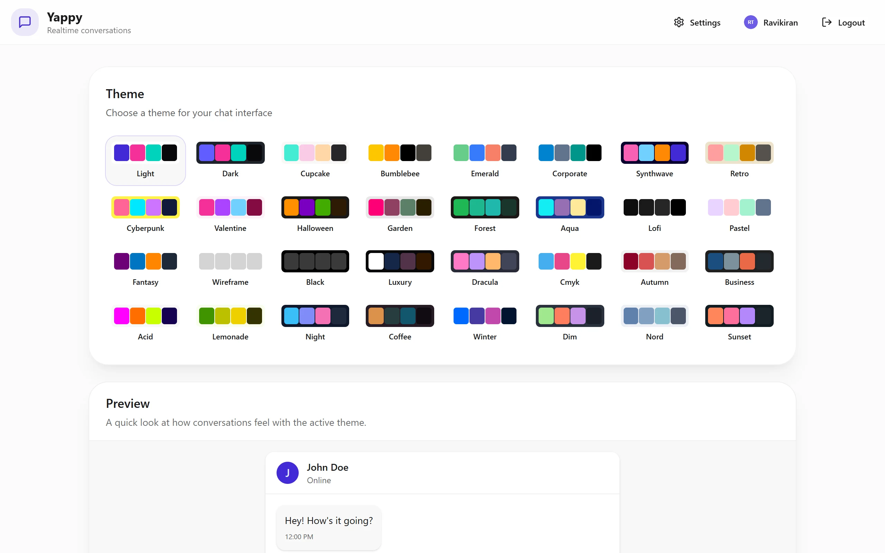<br /><strong>32 themes</strong><br />Choose a look and preview it instantly.</td>
    <td>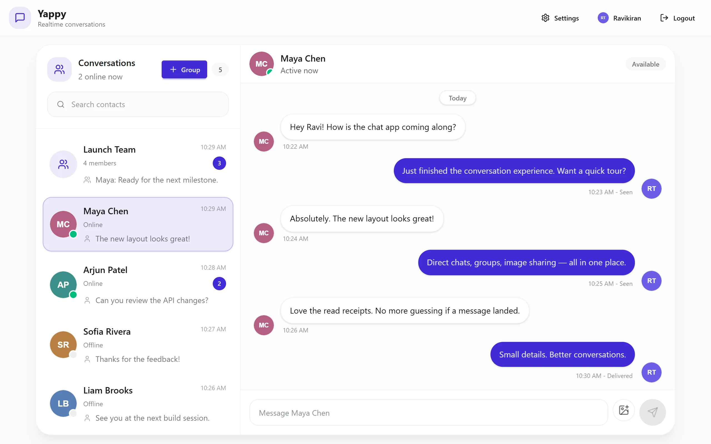<br /><strong>Light and dark styles</strong><br />Make the workspace your own.</td>
  </tr>
</table>

### Built for smaller screens, too

<p align="center">
  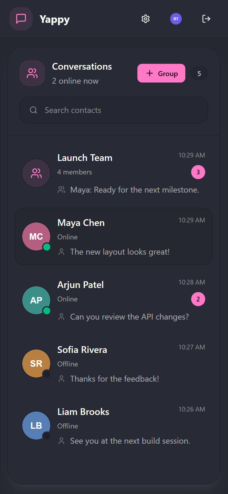
  &nbsp;&nbsp;
  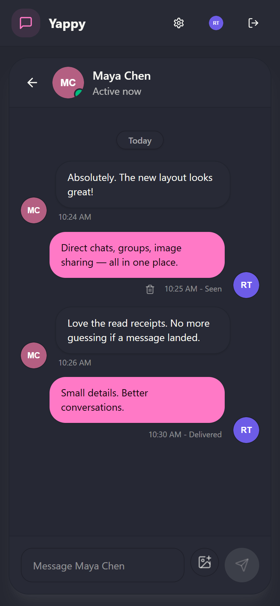
</p>

<details>
<summary><strong>View sign-in and profile screens</strong></summary>

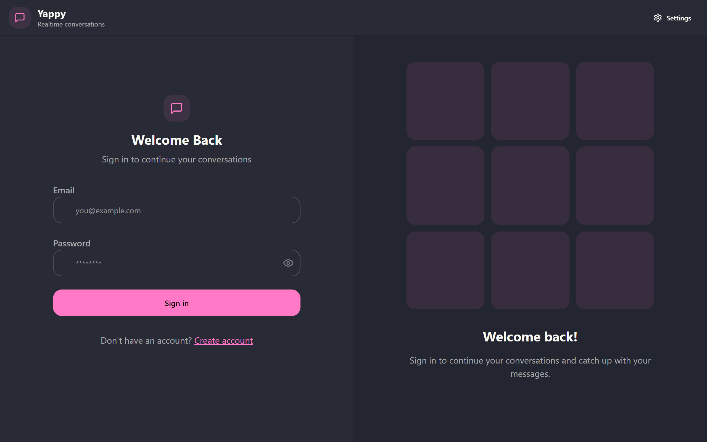

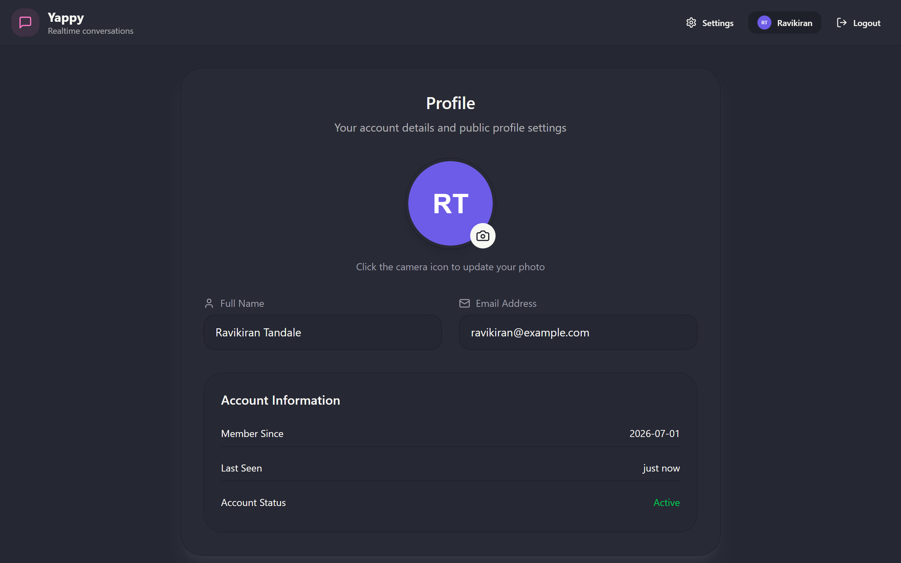

</details>

### Video walkthrough

**[Watch or download the captioned demo](showcase/portfolio/yappy-demo-web.mp4)** — approximately 33 seconds covering direct messaging, typing, read states, groups, image sharing, themes, and a mobile overview.

The media shows the actual application UI with fictional conversations and simulated API responses and socket events. It demonstrates the interface; it is not an end-to-end backend test. The video is silent with on-screen captions, and its mobile overview is a still composition.

## Tech stack

| Layer | Technologies |
| --- | --- |
| Interface | React 19, React Router 7, Lucide icons, React Hot Toast |
| Styling | Tailwind CSS 4, DaisyUI 5 |
| Client state | Zustand 5 |
| HTTP and real-time clients | Axios, Socket.IO Client 4 |
| Build tooling | Vite 6, ESLint 9 |
| Server | Node.js, Express 4, Socket.IO 4 |
| Database | MongoDB, Mongoose 8 |
| Authentication | JSON Web Tokens, bcryptjs, cookie-parser |
| Media storage | Cloudinary |

## System architecture

The React client uses REST requests to authenticate, load conversations, and persist changes. Express and Socket.IO share a Node.js HTTP server. MongoDB stores users, groups, and message history; Cloudinary stores uploaded images, whose URLs are saved with profiles or messages.

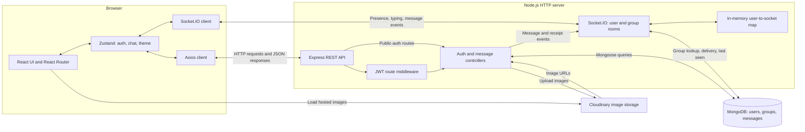

### How a direct message travels

1. The sender's Zustand store inserts a temporary message for immediate feedback.
2. Axios submits text and an optional image to `POST /api/messages/send/:id`.
3. JWT middleware identifies the sender. The controller uploads any image to Cloudinary and saves the message in MongoDB.
4. The server emits `message:new` to the sender's and recipient's user rooms. The HTTP response replaces the sender's temporary message with the persisted record.
5. `messages:delivered` and `messages:seen` update direct-message status. A failed send restores the previous client state and displays an error.

Group messages use a separate REST endpoint and `group:message:new` events. Typing events travel through Socket.IO without being stored as messages.

### Data model

| Collection | Main fields | Relationships |
| --- | --- | --- |
| `User` | `email`, `fullName`, hashed `password`, `profilePic`, `lastSeen` | Sends and receives messages; belongs to groups. |
| `Group` | `name`, `avatar`, `members`, `createdBy` | References member users and its creator. |
| `Message` | `text`, `image`, `deliveredAt`, `seenAt`, `seenBy` | References `senderId` and either `recieverId` or `groupId`. |

All models include timestamps. Message indexes cover direct-conversation and group history; groups are indexed by membership. `recieverId` preserves the field spelling used in the current schema.

### Authentication and runtime details

- Passwords are hashed with bcryptjs. JWTs expire after seven days.
- Protected REST routes accept a JWT cookie or a bearer token. The client also stores the returned token in local storage and attaches it to Axios requests.
- The JWT cookie is HTTP-only; `NODE_ENV=development` enables local HTTP cookie settings.
- Presence is held in memory with a set of socket IDs per user for multiple tabs or connections. Last-seen timestamps are saved when the final connection closes.
- The current socket handshake identifies users through a `userId` query parameter rather than JWT validation. Socket identity and room authorization are areas for further hardening.
- The implementation uses one Socket.IO server and an in-memory presence map; a shared adapter and distributed presence store are not configured.

## Getting started

### Prerequisites

- Node.js and npm compatible with the included Vite 6 dependencies.
- A running MongoDB instance or MongoDB Atlas connection string.
- A Cloudinary account for chat images and profile uploads.

### 1. Clone and install

```bash
git clone https://github.com/Ravi-rk7/Chat-app.git
cd Chat-app

cd backend
npm ci
cd ../frontend
npm ci
cd ..
```

### 2. Configure the backend

Create `backend/.env`:

```dotenv
PORT=5001
NODE_ENV=development
CLIENT_URL=http://localhost:5173
MONGODB_URL=mongodb://127.0.0.1:27017/yappy
JWT_SECRET=replace-with-a-long-random-secret
CLOUDINARY_CLOUD_NAME=your-cloud-name
CLOUDINARY_API_KEY=your-api-key
CLOUDINARY_API_SECRET=your-api-secret
```

Replace the MongoDB URL if using Atlas, and fill in your JWT secret and Cloudinary credentials. `CLIENT_URL` accepts comma-separated frontend origins. Keep `.env` files local; the repository ignores them.

### 3. Configure the frontend

Create `frontend/.env`:

```dotenv
VITE_API_URL=http://localhost:5001/api
VITE_SOCKET_URL=http://localhost:5001
```

The API URL includes `/api`; the socket URL points to the server origin. These values match the local defaults. Frontend environment variables are included in the browser build, so they must not contain secrets.

### 4. Start both services

From the repository root, run the backend in one terminal:

```bash
cd backend
npm run dev
```

Run the frontend in a second terminal:

```bash
cd frontend
npm run dev
```

Open **http://localhost:5173**. Register two accounts in separate browser sessions to try direct messages, typing, and read states. Use the **Group** button to create a shared conversation.

### Scripts

| Directory | Command | Purpose |
| --- | --- | --- |
| `backend` | `npm run dev` | Start the Node.js server; automatic restart is not enabled. |
| `frontend` | `npm run dev` | Start the Vite development server. |
| `frontend` | `npm run build` | Create the production frontend in `dist/`. |
| `frontend` | `npm run preview` | Preview the built frontend locally. |
| `frontend` | `npm run lint` | Run ESLint. |

### Deployment configuration

Build the frontend from `frontend/` with `npm run build`, and serve `frontend/dist` with an SPA fallback to `index.html`. Run the backend from `backend/` with `node src/index.js` on a host that supports persistent Socket.IO connections.

Set `VITE_API_URL` and `VITE_SOCKET_URL` before building the frontend. On the backend, set `CLIENT_URL` to the deployed frontend origin, configure database and Cloudinary credentials, and use `NODE_ENV=production` with HTTPS for secure cookies. The backend does not serve the frontend build.

## API reference

Paths below are relative to `/api`.

| Method | Endpoint | Auth required | Purpose |
| --- | --- | --- | --- |
| POST | `/auth/signup` | No | Register with `fullName`, `email`, and `password`. |
| POST | `/auth/login` | No | Sign in with `email` and `password`. |
| POST | `/auth/logout` | No | Clear the authentication cookie. |
| GET | `/auth/check` | Yes | Return the authenticated user. |
| PUT | `/auth/update-profile` | Yes | Upload a `profilePic`. |
| GET | `/messages/users` | Yes | Load contacts and groups with conversation metadata. |
| GET | `/messages/:id` | Yes | Load direct-message history with a user. |
| POST | `/messages/send/:id` | Yes | Send direct-message `text` and/or `image`. |
| POST | `/messages/seen/:id` | Yes | Mark incoming messages from a user as seen. |
| POST | `/messages/groups` | Yes | Create a group with `name` and `memberIds`. |
| GET | `/messages/group/:id` | Yes | Load a group's messages. |
| POST | `/messages/group/send/:id` | Yes | Send `text` and/or `image` to a group. |
| POST | `/messages/group/seen/:id` | Yes | Mark group messages as read by the current user. |
| DELETE | `/messages/:id` | Yes | Delete a message owned by the current user. |

## Project structure

```text
Chat-app/
├── backend/
│   ├── scripts/             # Dependency compatibility patch
│   └── src/
│       ├── controllers/     # Auth, direct messaging, and group logic
│       ├── lib/             # Database, Cloudinary, JWT, CORS, and sockets
│       ├── middleware/      # REST authentication
│       ├── models/          # User, Message, and Group schemas
│       ├── routes/          # Auth and message endpoints
│       └── index.js         # Express middleware and server startup
├── frontend/
│   ├── public/              # Static assets
│   └── src/
│       ├── components/      # Chat, sidebar, composer, and skeletons
│       ├── constants/       # Available themes
│       ├── lib/             # API configuration, token helpers, utilities
│       ├── pages/           # Auth, home, profile, and settings screens
│       ├── store/           # Zustand auth, chat, and theme stores
│       └── App.jsx          # Routes and application shell
├── showcase/               # Screenshots, cover, and demo used in this README
└── README.md
```

## Contributing

Open an issue to discuss a bug or enhancement, or submit a focused pull request with a description of the change and how you verified it. Run the frontend lint and build commands for UI changes; verify messaging changes with two separate browser sessions.
